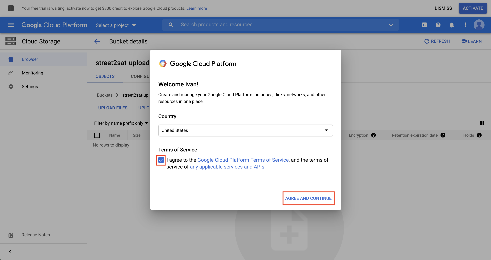
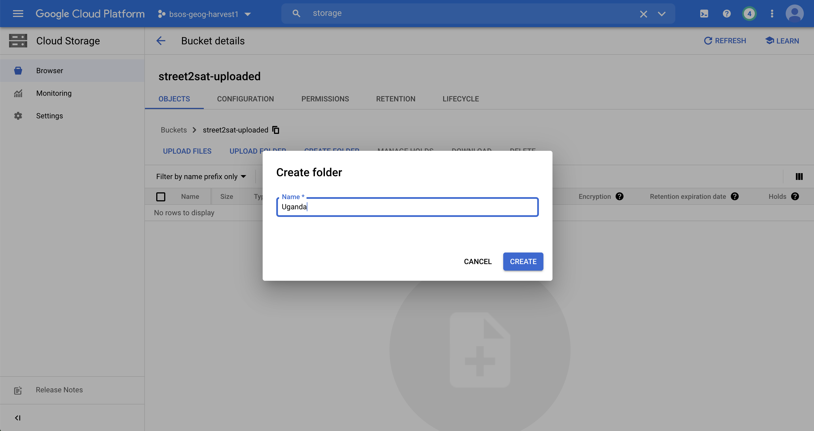
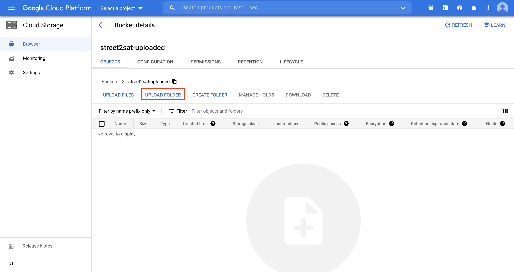
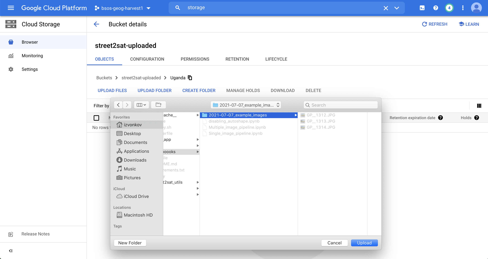
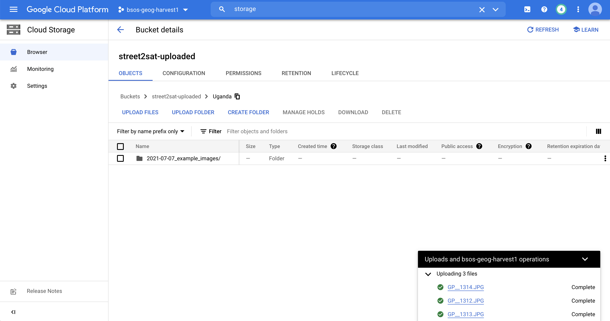

# Instructions for uploading images

## Getting Access (only done once)
1. Request access to upload images from NASA Harvest using form: https://forms.gle/RdDX6569Xkr7rE5c9.
2. Receive email with subject: **Google Cloud role update for "street2sat-uploaded"**

    

3. Navigate to the link provided. If prompted, select your country, check the box and click **Agree and Continue**:

    

## Uploading images
The following format `<COUNTRY>/<YYYY>-<MM>-<DD>-<FOLDER NAME>/*.jpg` will be used for keeping the bucket organized.
Images can be uploaded using the Google Cloud Console (for a small amount of images) or Google Cloud Storage CLI, gsutil (for a large amount of images).

#### Upload using the console
Ensure you are on https://console.cloud.google.com/storage/browser/street2sat-uploaded
1. Create a folder for the country where the images were taken (if it does not already exist).
    

2. Navigate to the `<COUNTRY>` and select **Upload folder**.

    

3. Selecting the folder with images:
    - Ensure the folder name contains the date at the beginning in the format YYYY-MM-DD
    - Ensure the folder name does not contain spaces
    

4. Verifying that the images were uploaded

    

#### Prerequisite for upload using gsutil
1. Ensure you have `gsutil` installed using either this [link](https://cloud.google.com/storage/docs/gsutil_install) or by executing `pip install gsutil`
2. Run `gsutil config` and follow the prompts to set it up.

#### Upload using gsutil
1. Specify the source folder, country, date and destination folder and run the below command.
```bash
gsutil cp -r <SOURCE FOLDER>/* gs://street2sat-uploaded/<COUNTRY>/<YYYY>-<MM>-<DD>-<FOLDER NAME>
```

That's it!

Next time new images are available you can start directly from **Upload using gsutil** or **Upload using the console**
