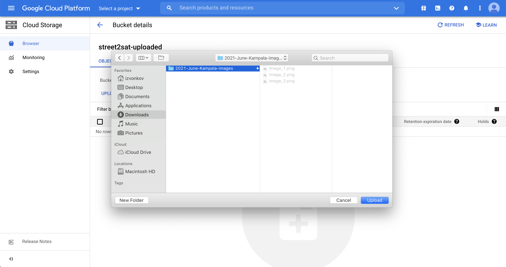

# Instructions for uploading images

## Getting Access (only done once)
1. Request access to upload images from NASA Harvest using form: https://forms.gle/RdDX6569Xkr7rE5c9.
2. Receive email with subject: **Google Cloud role upade for "street2sat-uploaded"**

    

3. Navigate to the link provided, select your country, check the box and click **Agree and Continue**:

    

## Uploading images
1. You can now upload a folder of images from your computer by clicking **Upload folder**

    

2. Selecting the folder with images
    

3. Verifying that the images were uploaded

    

That's it! 

Next time new images are available you can navigate directly to https://console.cloud.google.com/storage/browser/street2sat-uploaded and follow the steps in **Uploading images**

